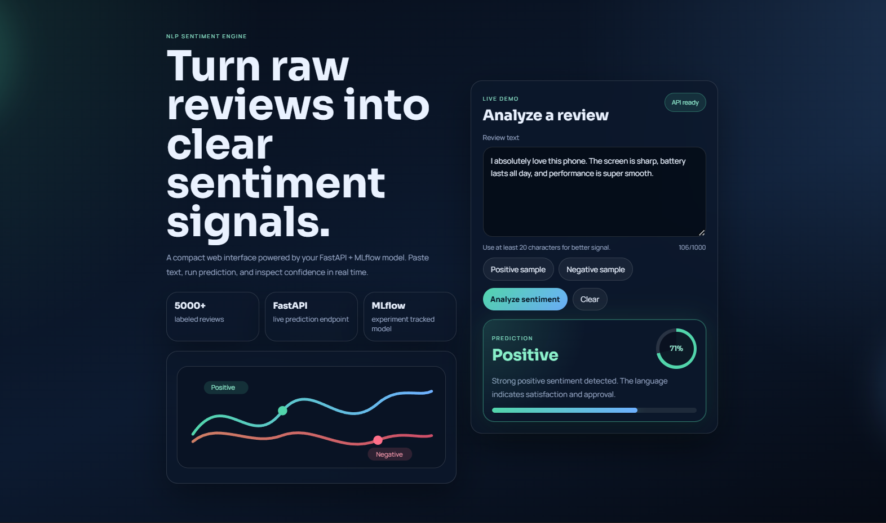

# 🧠 Sentiment Radar

> An end-to-end NLP web app that classifies product reviews as **positive** or **negative** in real time using a scikit-learn pipeline, MLflow tracking, a FastAPI backend, and a modern vanilla frontend.

# [LIVE DEMO](https://ai-sentiment-classifier.onrender.com)



---

## ✨ Features

- **NLP pipeline** — text cleaning, TF-IDF vectorization, and Logistic Regression for binary sentiment classification
- **Experiment tracking** — MLflow logs parameters, metrics, and model artifacts for each run
- **REST API** — FastAPI backend with `/predict` and `/health` endpoints
- **Modern UI** — responsive dark interface built with plain HTML, CSS, and JavaScript
- **Docker ready** — single-container deployment with a Render-friendly `PORT` setup
- **Render ready** — easy cloud deployment with a stable public URL

---

## 🛠 Tech stack

| Layer | Technology |
|---|---|
| Model | scikit-learn · LogisticRegression · TF-IDF |
| Tracking | MLflow |
| API | FastAPI · Uvicorn |
| Frontend | Vanilla HTML · CSS · JavaScript |
| Container | Docker |
| Deploy | Render |

---

## 📁 Project structure

```text
sentiment-radar/
├── assets/
│   └── website.png           # Frontend screenshot used in this README
├── data/                      # Local dataset and SQLite database files
├── mlruns/                    # MLflow run artifacts
├── src/
│   ├── api.py                 # FastAPI app and prediction endpoints
│   ├── config.py              # Paths and environment configuration
│   ├── db.py                  # SQLAlchemy models and SQLite engine
│   ├── seed_db.py             # Dataset seeding helper
│   ├── train.py               # Training pipeline + MLflow logging
│   └── static/
│       ├── index.html         # Frontend entry point
│       ├── styles.css         # UI styles
│       └── app.js             # Frontend logic
├── Dockerfile
├── requirements.txt
└── README.md
```

---

## 🚀 Quick start

### Option 1: Run with Docker

```bash
docker build -t sentiment-radar .
docker run -p 10000:10000 sentiment-radar
```

Open:

- `http://localhost:10000`

### Option 2: Run locally without Docker

```bash
pip install -r requirements.txt
```

Then start the API:

```bash
set PYTHONPATH=src
uvicorn api:app --host 0.0.0.0 --port 8000 --app-dir src
```

Open:

- `http://localhost:8000`

> If you open the frontend with Live Server, keep the API running separately on port `8000` or `10000`.

---

## 🧪 Model workflow

1. Reviews are stored in the local SQLite database.
2. `src/train.py` loads the data and trains a text classification pipeline.
3. MLflow logs the experiment run and model artifact.
4. `src/api.py` loads the latest trained model and serves predictions through the API.

### Training the model

```bash
set PYTHONPATH=src
python src/train.py
```

---

## 🌐 Deploy on Render

1. Push the repository to GitHub.
2. Go to [render.com](https://render.com) and create a **New Web Service**.
3. Connect your GitHub repository.
4. Select **Docker** as the environment.
5. Deploy the service.
6. Render will assign a public URL like `https://your-app.onrender.com`.

> The container is configured to respect the `PORT` environment variable, which is the safest setup for Render.

---

## 📡 API endpoints

| Method | Endpoint | Description |
|---|---|---|
| `GET` | `/` | Serves the frontend |
| `GET` | `/health` | Returns API and model status |
| `POST` | `/predict` | Returns the predicted sentiment |

### Example `/predict` request

```json
{
  "text": "I absolutely love this phone. The screen is sharp and the battery lasts all day."
}
```

### Example response

```json
{
  "sentiment": "Positive",
  "confidence": 0.97
}
```

---

## 🖼 Frontend preview

The UI is intentionally minimal, modern, and responsive. It includes:

- a clear hero section
- a live prediction card
- sample review buttons
- confidence visualization
- green/red animated feedback based on the prediction

---

## 👤 Author

[@raess1593](https://github.com/raess1593)